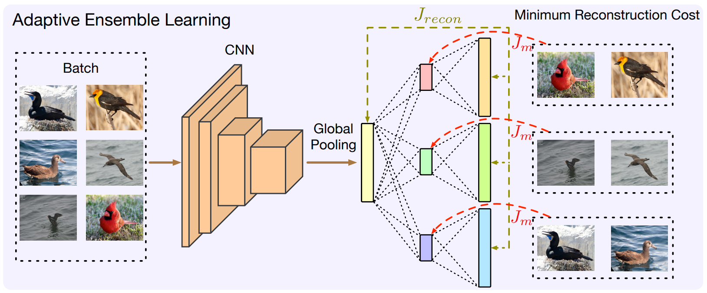
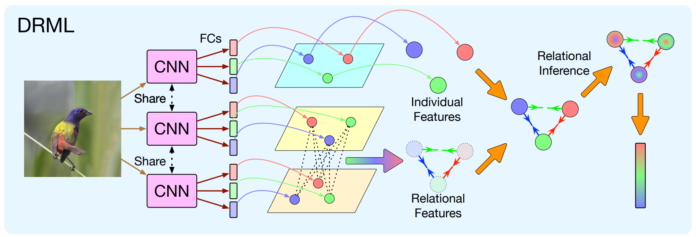

# Deep Relational Metric Learning

This repository is the official PyTorch implementation of **Deep Relational Metric Learning**. 

## News

- \[2021-12-14\]: Update gedml to the newest version 2.0.1.

## Framework





## Datasets 

### CUB-200-2011

Download from [here](http://www.vision.caltech.edu/visipedia/CUB-200-2011.html).

Organize the dataset as follows:

```
- cub200
    |- train
    |   |- class0
    |   |   |- image0_1
    |   |   |- ...
    |   |- ...
    |- test
        |- class100
        |   |- image100_1
        |   |- ...
        |- ...
```

### Cars196

Download from [here](http://ai.stanford.edu/~jkrause/cars/car_dataset.html).

Organize the dataset as follows:

```
- cars196
    |- train
    |   |- class0
    |   |   |- image0_1
    |   |   |- ...
    |   |- ...
    |- test
        |- class98
        |   |- image98_1
        |   |- ...
        |- ...
```

## Requirements

To install requirements:

```setup
pip install -r requirements.txt
```

## Training

### Baseline models 

To train the baseline model with the ProxyAnchor loss on CUB200, run this command:

```train
CUDA_VISIBLE_DEVICES=0 python examples/demo.py --data_path /home/zbr/Workspace/datasets --save_path /home/zbr/Workspace/exp/DRML --device 0 --batch_size 180 --test_batch_size 180 --setting proxy_anchor --embeddings_dim 512 --proxyanchor_margin 0.1 --proxyanchor_alpha 32 --num_classes 100 --wd 0.0001 --gamma 0.5 --step 10 --lr_trunk 0.0001 --lr_embedder 0.0001 --lr_collector 0.01 --dataset cub200 --delete_old --warm_up 1 --warm_up_list embedder collector 
```

### DRML models

To train the proposed DRML model using the ProxyAnchor loss on CUB200 in the paper, run this command:

```train
CUDA_VISIBLE_DEVICES=0 python examples/demo.py --data_path /home/zbr/Workspace/datasets --save_path /home/zbr/Workspace/exp/DRML --device 0 --batch_size 180 --test_batch_size 180 --setting proxy_anchor_drml --embeddings_dim 512 --features_dim 1024 --branch_num 4 --proxyanchor_margin 0.2 --proxyanchor_alpha 64 --num_classes 100 --wd 0.0001 --gamma 0.5 --step 10 --lr_trunk 0.00005 --lr_embedder 0.001 --lr_collector 0.01 --weight_recon_loss 1 --weight_repre_loss 10 --dataset cub200 --delete_old --warm_up 1 --warm_up_list embedder ensemble repre 
```

## Device 

We tested our code on a linux machine with an Nvidia RTX 3090 GPU card. We recommend using a GPU card with a memory > 8GB (BN-Inception + batch-size of 120 ).

## Results

The baseline models achieve the following performances:

| Model name | Recall @ 1 | Recall @ 2 | Recall @ 4 | Recall @ 8 | NMI |
| - | - | - | - | - | - |
| cub200-ProxyAnchor-baseline | 67.3 | 77.7 | 85.7 | 91.4 | 68.7 |
| cars196-ProxyAnchor-baseline | 84.4 | 90.7 | 94.3 | 96.8 | 69.7 |

Our models achieve the following performances:

| Model name | Recall @ 1 | Recall @ 2 | Recall @ 4 | Recall @ 8 | NMI |
| - | - | - | - | - | - |
| cub200-ProxyAnchor-ours | 68.7 | 78.6 | 86.3 | 91.6 | 69.3 |
| cars196-ProxyAnchor-ours | 86.9 | 92.1 | 95.2 | 97.4 | 72.1 |

## COMING SOON

- [ ] We will upload the code for cross-validation setting soon.